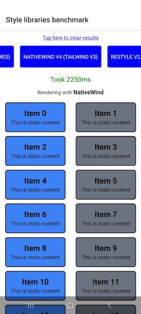

# React Native Style Libraries Benchmark (Updated July 2025)

This project is an updated performance benchmark of popular styling libraries in the React Native ecosystem. This is an Expo SDK 53 (with React Native 0.79.5) App reproducer to demonstrate the performance difference between the libraries.

The work is based on the benchmark from [divineniiquaye/react-native-style-libraries-benchmark](https://github.com/divineniiquaye/react-native-style-libraries-benchmark), which was originally created by [@tj-mc](https://github.com/tj-mc/styled-components-native-perf-reproducer).

### ***Note: Test scores may vary between different machines with different hardware.***

## Benchmark Setup

The tests were conducted with the following configuration:

*   **Device:** Samsung Galaxy A56
*   **Framework:** Expo SDK 53 (React Native 0.79.5)
*   **Build Command:** `npx expo run:android --variant=release`
*   **Test Scenario:** Rendering 1000 simple `<View>` components with static content.
*   **Methodology:** Each library's test was executed 10 times, and the average rendering time was recorded.

It's important to note that this is a **basic** stress test. When more features of each library are added (e.g., media queries, variants, etc.) as your project grows, the performance measurements may vary.

## Libraries Tested

The following libraries and their latest versions (as of July 2025) were included in this benchmark:

*   **Twrnc:** v4.9 (previously tailwind-react-native-classnames)
*   **NativeWind:** v4 (with Tailwind CSS v3)
*   **Restyle:** v2.4
*   **Styled Components:** v6.1
*   **Tamagui:** v1.132
*   **Unistyles:** v3
*   **React Native StyleSheet** (for baseline comparison)

## Performance Results

The table below shows the average time taken to render 1000 views for each library, sorted from fastest to slowest.

| Rank | Library | Version | Average Render Time (ms) |
| :--- | :--- | :--- | :--- |
| 1 | Restyle | v2.4 | **1600 ms** |
| 2 | React Native StyleSheet | - | **1620 ms** |
| 3 | Unistyles | v3 | **1650 ms** |
| 4 | Styled Components | v6.1 | **1680 ms** |
| 5 | Tamagui | v1.132 | **1740 ms** |
| 6 | Twrnc | v4.9 | **1900 ms** |
| 7 | NativeWind | v4 | **2150 ms** |

## Conclusion

The 2025 benchmark shows that for raw rendering performance of a large number of simple components, **Restyle** performed the best, closely followed by the built-in **React Native StyleSheet** and **Unistyles**.

Libraries that offer more complex features and a different developer experience, like **Twrnc** and **NativeWind**, showed a measurable performance overhead in this specific stress test. Developers should consider this trade-off between performance and features when choosing a styling solution for their projects.

## Credits

*   **Original Benchmark Repo:** [divineniiquaye/react-native-style-libraries-benchmark](https://github.com/divineniiquaye/react-native-style-libraries-benchmark)
*   **Original Reproducer:** [@tj-mc/styled-components-native-perf-reproducer](https://github.com/tj-mc/styled-components-native-perf-reproducer)

Feel free to fork this repo with improvements or to include other styling libraries.
